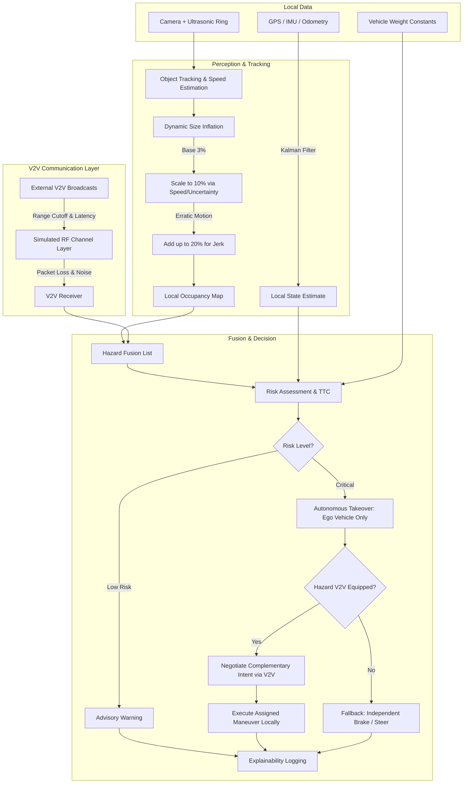

# Technical Roadmap: Intelligent Navigation & Collision-Avoidance System

## Document Purpose & Target Audience
This roadmap is structured as a definitive architectural and implementation guide. It is written with high explicitness to serve as an ingestible context document for AI development agents and human engineers. It strictly defines the data structures, operational boundaries, logic rules, and integration sequences required to build a hybrid local-perception and V2V-assisted autonomous system.

---

## Core System Architecture: The Two-Tier Data Model

The system enforces a strict firewall between local and shared data to guarantee that the ego vehicle can survive entirely on its own perception if V2V is unavailable.

### 1. Local Data (Ego-Private)
* **Definition:** High-frequency, high-precision state data and localized sensor maps.
* **Attributes:** Continuous position/heading, ego vehicle weight constants (for kinetic/braking math), raw sensor point clouds, local tracked object lists, and calculated Time-To-Collision (TTC).
* **Rule:** This data is **NEVER** broadcast. It strictly drives local actuation.

### 2. External Data (Shared / V2V)
* **Definition:** Deliberately minimized packets shared over simulated/real RF channels.
* **Attributes:** Position and Speed only.
* **Rule:** Broadcast at a fixed rate (e.g., 10Hz). Cannot be trusted as ground truth without sanity-checking (e.g., filtering out impossible coordinate jumps).

---

## System Flowchart

---

## Development Phases (Execution Order)

The implementation sequence is highly intentional. Phases 1-5 construct a fully autonomous agent capable of dodging unequipped obstacles. Phases 6-11 layer the simulated networking, fusion, and cooperative negotiation on top.

### Phase 1: Local Vehicle State
* **Objective:** Establish the ego vehicle's exact spatial truth.
* **Implementation Steps:**
    1. Read raw GPS, IMU, and Odometry data.
    2. Implement a Kalman Filter to fuse these into a clean `(x, y, theta, velocity)` state.
    3. Load static configurations (vehicle weight, max braking deceleration) into memory.

### Phase 2: 360° Onboard Perception
* **Objective:** Eliminate structural blind spots without relying on external V2V data.
* **Implementation Steps:**
    1. Initialize front-facing wide-angle camera (handles long-range detection and classification).
    2. Initialize 8-zone ultrasonic ring (handles close-proximity detection on sides and rear).
    3. Normalize coordinate frames so all sensor hits translate to the ego vehicle's center.

### Phase 3: Object Tracking & Relative Speed Estimation
* **Objective:** Convert raw sensor "blobs" into persistent, tracked entities.
* **Implementation Steps:**
    1. Implement a data association algorithm (e.g., Hungarian algorithm + bounding box IoU) to map current detections to existing tracks.
    2. Calculate relative speed strictly via positional delta between frames (differentiating position over time).
    3. Assign a "Confidence Score" to each track based on its lifespan (frames tracked continuously).

### Phase 4: Dynamic Size Inflation (Crucial Safety Logic)
* **Objective:** Apply algorithmic safety margins based on kinematic uncertainty.
* **Logic Rules:**
    1. **Base Inflation:** Add `+3%` to the physical bounding box for standard sensor noise.
    2. **Scaling Factor:** Scale from `3%` up to `10%` inversely proportional to track confidence, and directly proportional to estimated relative speed.
    3. **Erratic/Jerk Bonus:** Calculate acceleration derivative (jerk). If variance exceeds safe thresholds (erratic behavior), apply an additional uncapped (or artificially capped at `+20%`) inflation buffer.

### Phase 5: Local Occupancy Representation
* **Objective:** Create the operational spatial map.
* **Implementation Steps:**
    1. Project all dynamically inflated tracked objects and static obstacles into a 2D local grid map.
    2. Expose this grid to the planner.
    *Milestone: At this stage, the vehicle can navigate and survive a world of unequipped obstacles.*

### Phase 6: Realistic V2V Communication Layer (Simulated RF)
* **Objective:** Prevent "perfect simulation syndrome" by modeling actual radio physics.
* **Implementation Steps:**
    1. **Range Cutoff:** Drop messages instantly if distance `> Max_RF_Range`.
    2. **Latency:** Buffer incoming messages in a queue for `X ms` before releasing them to the receiver logic.
    3. **Packet Loss & Congestion:** Implement a stochastic drop function based on distance and concurrent broadcaster density.
    4. **Noise Injection:** Add Gaussian noise to transmitted position coordinates.
    5. **Fixed Update Rate:** Throttle broadcast emissions strictly to network standard (e.g., `10Hz`).

### Phase 7: Sensor & V2V Fusion
* **Objective:** Merge local map data with incoming network broadcasts.
* **Implementation Steps:**
    1. Maintain a `Hazard Fusion List`.
    2. For objects detected locally but NOT via V2V: Use estimated Phase 3 speeds.
    3. For objects detected via V2V but NOT locally (behind walls, extreme distance): Use exact V2V broadcast speeds.
    4. For dual-detected objects: Mark as `High-Confidence`, overriding local speed estimation with V2V precision.

### Phase 8: Risk Assessment (TTC)
* **Objective:** Determine crash probability continuously.
* **Implementation Steps:**
    1. Calculate Time-To-Collision (TTC) for every object in the Fusion List.
    2. Math must strictly utilize the **inflated boundaries** from Phase 4, NOT the raw center-points.

### Phase 9: Decision & Guidance (Ego Control)
* **Objective:** Safely actuate the vehicle or inform the driver.
* **Implementation Steps:**
    1. **Threshold LOW:** Trigger UI/Audio advisory warning.
    2. **Threshold CRITICAL:** Trigger actuator takeover.
    3. **Conflict Handler (Unequipped):** If multiple critical threats demand opposing steering vectors, default to maximum emergency braking.
    *Rule: The system only ever commands the ego vehicle's actuators.*

### Phase 10: Coordinated Resolution (V2V Intent Negotiation)
* **Objective:** Prevent symmetrical collisions between two equipped smart vehicles.
* **Implementation Steps:**
    1. When a conflict triggers Phase 9, check if the hazard is V2V-equipped.
    2. If YES: Transmit an intent packet (e.g., "Ego braking, requesting you steer left").
    3. Apply aircraft TCAS-style logic: vehicles agree on complementary maneuvers over the network.
    4. If NO: Immediately drop to Phase 9 independent braking logic.

### Phase 11: Explainability & Logging
* **Objective:** Ensure system behavior is mathematically and logically auditable.
* **Implementation Steps:**
    1. Write state transitions to a secure log.
    2. Format: `[Timestamp] [Action Taken] [Primary Trigger] [Bounding Box Inflation %] [V2V/Local Source]`.
    3. Generate plain-language string outputs for post-drive review.
